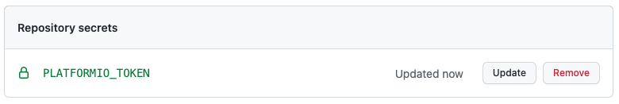

# Hello world docker action

This action deploys a library to the PlatformIO registry.

To use this environment you need to generate a [Personal Authentication Token](https://docs.platformio.org/en/latest/core/userguide/account/cmd_token.html) for your PlatformIO account

## Inputs

### `token`

**Required** PlatformIO Personal Authentication Token: Typically add this as a secret to your GitHub repository:



## Outputs

N/A

## Example usage

```yaml
uses: bojit/platformio-publish@main
with:
  token: ${{ secrets.PLATFORMIO_TOKEN }}
```
